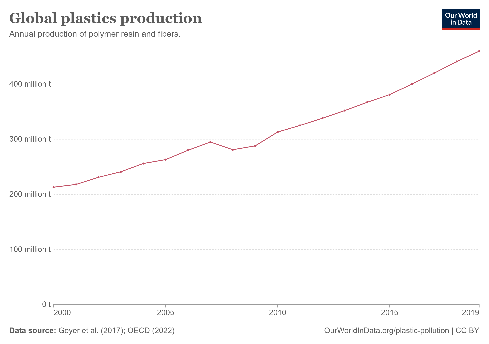
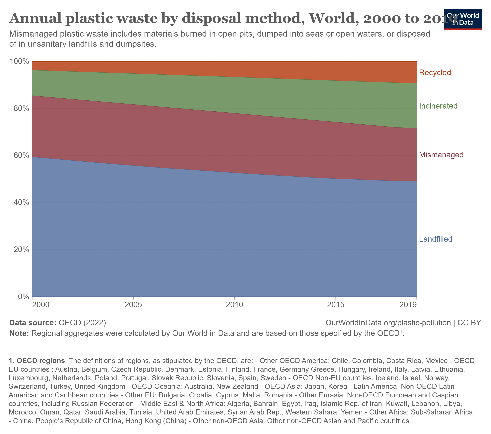
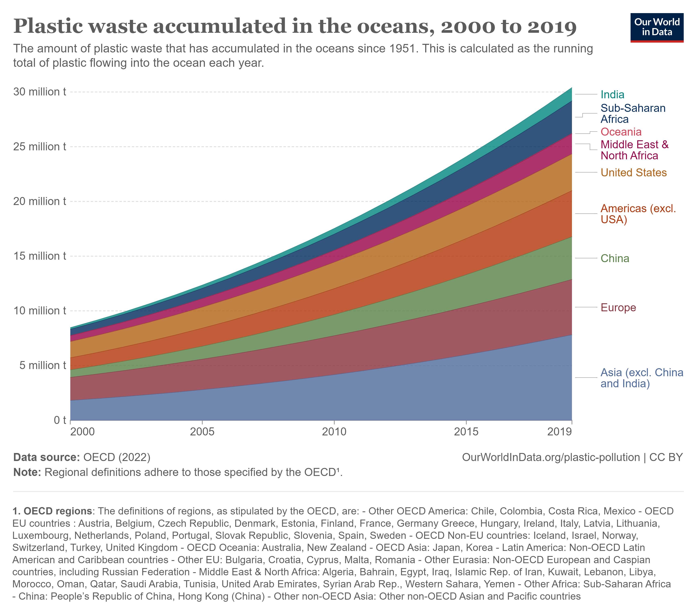

#  OceanCare - Global Solution 2024

## Escopo do Projeto:

O aplicativo OceanCare visa promover a conscientização e ação direta sobre a conservação dos oceanos. Através de uma plataforma digital interativa, o aplicativo pretende envolver a comunidade em projetos de limpeza e conservação, e incentivar comportamentos ecologicamente responsáveis por meio de um sistema de recompensas e ranking.

## Principais Funcionalidades:

### Recompensas e Missões:

* Reporte de lixos:
Ao avistar um lixo nas praias, o usuário poderá realizar um reporte do mesmo, cadastrando o tipo do lixo, uma descrição e o local onde foi encontrado, fazendo isso o usuário ganha pontos e conquistas que futuramente poderão ser trocados por prêmios.

* Eventos de limpeza:
Diversos eventos de limpeza podem ser cadastrados na plataforma, onde o usuário pode verificar, o nome do evento, data de início e final do evento, descrição, localização, quantos participantes já estão inscritos e também inscrever-se no evento.

* Ranking e Pontuação:
O usuário poderá acompanhar um ranking com todas as pessoas que estão cadastradas no aplicativo, sendo ordenado do maior nível de lixo reportado para o menor nível, assim será possível verificar quem esta mais contribuindo na limpeza de praias.

### Objetivo:

* O aplicativo busca não apenas informar, mas também transformar a consciência ambiental em ação prática. Com funcionalidades que engajam os usuários de maneira ativa, o projeto almeja criar uma comunidade vibrante e consciente que contribua regularmente para a saúde dos ecossistemas marinhos.

## **Detecção de Imagens OceanCare**

### Objetivo

- O algoritmo foi aplicado com o intuito de identificar espécies nativas, invasoras e lixo no mar, em ecossistemas específicos, para prevenir desequilibrios na fauna e flora local, além de, através da detecção de seres invasores, servir de alerta para surgimento de investigações mais profundas acerca da causa da aparição dessas espécies exóticas no ambiente monitorado. Também, com a identificação de tipos de lixo específicos, é possível analisar regiões carentes de uma limpeza e coleta dos resíduos vazados ao mar. Portanto, o ponto de chegada deste segmento do projeto consiste no constante monitoramento e vigilância de regiões marinhas específicas, promovendo a preservação do oceano.

### Base de pesquisa

- Atualmente, foram escolhidos os Recifes de Coral para realizar o monitoramento. Os recifes são ecossistemas de extrema biodiversidade e produtividade, suportando, em diversas regiões, atividades de turismo e pesca.

- Para o teste da implementação, foram escolhidas 13 classes a serem identificadas pelo modelo, sendo elas 5 espécies nativas, 5 espécies invasoras e 3 tipos de lixo:

#### - Espécies Nativas
1.   Tartaruga Marinha (Chelonioidea)
2.   Peixe Palhaço (Amphiprioninae)
3.   Peixe Papagaio (Scaridae)
4.   Peixe Anjo (Pomacanthidae)
5.   Estrela-do-Mar (Asteroidea)

#### - Espécies Invasoras
1.   Peixe Leão (Pterois volitans)
2.   Coral-Sol (Tubastraea coccinea/Tubastraea tagusensis)
3.   Mexilhão Zebra (Dreissena polymorpha)
4.   Molusco Asiático (Potamocorbula amurensis)
5.   Alga Assassina (Caulerpa taxifolia)

#### - Lixo
1.   Bitucas de Cigarro
2.   Garrafas Pet
3.   Sacolas Plásticas

### Tecnologias utilizadas

- Para treinamento do modelo foi utilizado a ferramenta de detecção de objetos do  [Roboflow](https://roboflow.com/). Foram utilizadas 140 imagens para o treinamento (de 10 a 12 imagens para cada classe, aproximadamente).

- Para visualização das imagens na apresentação, foi utilizada a função [Display](https://ipython.readthedocs.io/en/stable/api/generated/IPython.display.html) da biblioteca IPython.

### Fontes utilizadas

- [WikiPedia: Recife de coral](https://pt.wikipedia.org/wiki/Recife_de_coral)

- [Reef Resilience Network: Ecologia de recife de coral](https://reefresilience.org/pt/coral-reef-ecology/)

- [Reef Resilience Network: Ameaças Locais](https://reefresilience.org/pt/stressors/local-stressors/)

- [Ministério do Meio Ambiente e Mudança do Clima](https://www.gov.br/mma/pt-br/assuntos/biodiversidade-e-ecossistemas/fauna-e-flora/especies-exoticas-invasoras)

## **Regressão Linear - Plástico**

### Objetivo

- O modelo foi aplicado com o objetivo de predizer valores futuros da produção anual, vazamento ao oceano e reciclagem de plástico, dos anos 2020 a 2050, para avaliar o quão preocupante será a situação da má administração do lixo futuramente, no caso da continuação dos procedimentos de tratamento e manejamento do lixo como foram dos anos 2000 a 2019.

### Bases de Dados

- Para realização das predições foram utilizadas 3 bases de dados diferentes, todas retiradas do site [Our World Data](https://ourworldindata.org/), artigo [Plastic Pollution](https://ourworldindata.org/plastic-pollution?insight=plastic-production-has-more-than-doubled-in-the-last-two-decades#key-insights):

1.   [Global plastics production](https://ourworldindata.org/grapher/global-plastics-production)
   

2.   [Annual plastic waste by disposal method, World, 2000 to 2019](https://ourworldindata.org/grapher/plastic-fate)

3.  [Plastic waste accumulated in the oceans, 2000 to 2019](https://ourworldindata.org/grapher/plastic-waste-accumulated-in-oceans)

### Tratamento

- Para utilizar os dados das 3 bases, foram retirados os anos 1950 a 1999 do dataset de produção de plástico e separada para uso, somente as linhas contendo dados mundiais dos datasets de plástico acumulado no oceano e desperdício de plástico por método de despejo.

- Após isso, foram escolhidas as colunas ano, produção anual de plastico, vazamento de plástico ao oceano e plástico reciclado, adicionadas em um único dataset.

- Por fim, considerando baixa a quantidade de dados (somente 20 linhas de cada coluna), foi realizado um processo para adicionar uma coluna de meses, estimando o valor de cada mês com base na diferença entre um ano e o anterior, aumentando assim a base de treinamento de 20 linhas para 240.

### Treinamento do Algoritmo de Regressão 

- Foi criado uma terceira coluna 'Time' para agrupar os dados de ano e mês, simplificando a separação dos dados X para o treinamento.

- Logo após, foi aplicado o algoritmo LinearRegression para cada um dos 3 dados indicados à previsão (Plastic Leakage, Plastic Production e Recycled Plastic).

- Ao final, as predições foram agrupadas em um único dataset de resultado, e foram adicionadas duas colunas de porcentagem dos valores de Recycled Plastic e Plastic Leakage, em relação ao valor de Plastic Production (100%).

### Tecnologias Utilizadas

1.   [Pandas](https://pandas.pydata.org/) - Utilizado para administração das Bases de dados em formato DataFrame;
2.   [Sikit-Learn](https://scikit-learn.org/stable/) - Utilizado para aplicação do modelo de Regressão Linear e obtenção das predições;
3.   [NumPy](https://numpy.org/) - Utilizado para simplificar as criação das colunas de ano e mês nos dataframes de resultado
4.   [MatPlotLib](https://matplotlib.org/) - Utilizado para apresentação dos resultados em gráficos
